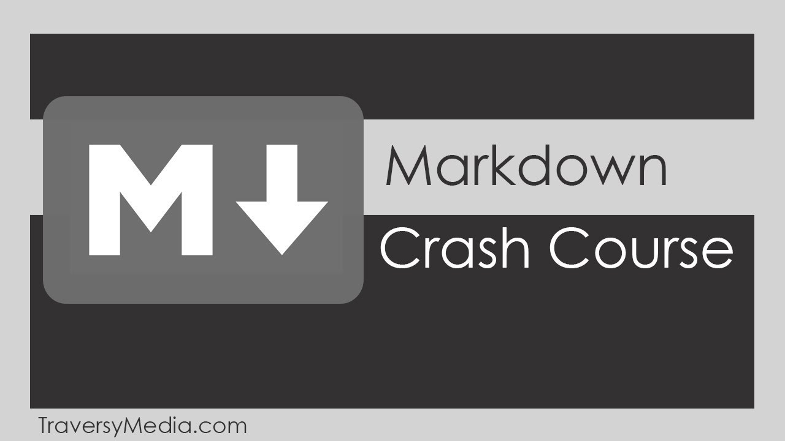

# My notes from the Traversy Media Markdown Crash Course

Here is a [link](https://www.udemy.com/share/10014sCUoacF5WRQ==/ 'Traversy Media') to the full course on YouTube. It only lasts about 20 minutes.

The first half of the video lecture covers core markdown syntax. The second half covers github related markdown syntax.

